# tools.feranet.fr

A collection of tools for developers and creators.

> This is a simple website to list all the tools I use on a daily basis.

## Setup

```bash
npm install
npm run dev
```

## Tools

### Design

| Name                                                                      | URL                                             |
| ------------------------------------------------------------------------- | ----------------------------------------------- |
|  Photopea             | https://www.photopea.com/                       |
|  Vecta                   | https://vecta.io/nano                           |
|  Convertio           | https://convertio.co                            |
|  Haikei                 | https://haikei.app/                             |
| 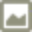 Base64 Image           | https://www.base64-image.de/                    |
|  Canva                   | https://www.canva.com/                          |
|  Trangram             | https://www.trangram.com/                       |
|  Radix Colors            | https://www.radix-ui.com/colors                 |
|  Tailwindcss Color | https://tailwindcss.com/docs/customizing-colors |
|  Pico CSS              | https://picocss.com/                            |

### Icon

| Name                                                                      | URL                                  |
| ------------------------------------------------------------------------- | ------------------------------------ |
|  Radix icons             | https://www.radix-ui.com/icons       |
|  Lucide                 | https://lucide.dev/                  |
|  Material Icons | https://fonts.google.com/icons       |
|  Font Awesome     | https://fontawesome.com/search       |
|  Pictogrammers   | https://pictogrammers.com/libraries/ |
|  Icones 8              | https://icones8.fr/icons/color       |
|  SVGPORN               | https://svgporn.com/                 |
|  Clearbit             | https://clearbit.com/logo            |
|  Emojipedia         | https://emojipedia.org/              |

### UI Library

| Name                                                                    | URL                         |
| ----------------------------------------------------------------------- | --------------------------- |
|  shadcn UI         | https://ui.shadcn.com/      |
|  Aceternity UI | https://ui.aceternity.com/  |
|  Tailwindcss     | https://tailwindcss.com/    |
|  Bootstrap         | https://getbootstrap.com/   |
|  Tabler               | https://tabler.io/          |
|  VueUse               | https://vueuse.org/         |
|  VuePress           | https://vuepress.vuejs.org/ |
|  Vuetify             | https://vuetifyjs.com/en/   |

### AI

| Name                                                                            | URL                                   |
| ------------------------------------------------------------------------------- | ------------------------------------- |
|  ChatGPT                     | https://chat.openai.com/              |
|  Bing Copilot           | https://www.bing.com/chat             |
|  Gemini                       | https://gemini.google.com/            |
|  Perplexity               | https://www.perplexity.ai/            |
|  Mistral                     | https://mistral.ai/                   |
|  Claude                       | https://claude.ai/                    |
|  Groq                           | https://groq.com/                     |
| 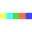 DALL·E 2                     | https://openai.com/dall-e-2           |
| 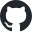 Github Copilot       | https://copilot.github.com/           |
| 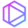 Tabnine                     | https://www.tabnine.com/              |
|  V0                               | https://v0.dev/                       |
|  Upscale                     | https://www.upscale.media/            |
|  Remove bg                 | https://www.remove.bg/                |
|  Watermark Remover | https://www.watermarkremover.io/      |
|  Vectorizer               | https://vectorizer.ai/                |
|  DeepAI                       | https://deepai.org/                   |
| 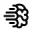 Ideogram                   | https://ideogram.ai/                  |
|  Leonardo                   | https://leonardo.ai/                  |
|  Seaart                       | https://www.seaart.ai/                |
|  Midjourney               | https://www.midjourney.com/           |
|  Clipdrop                   | https://clipdrop.co/                  |
|  Recraft                     | https://www.recraft.ai/               |
|  Remaker                     | https://remaker.ai/                   |
|  Magnific                   | https://magnific.ai/                  |
|  Fooocus              | https://github.com/lllyasviel/Fooocus |
|  Suno AI                     | https://www.suno.ai/                  |
|  Udio                           | https://www.udio.com/                 |
|  Audiobox                   | https://audiobox.metademolab.com/     |
|  Elevenlabs               | https://elevenlabs.io/                |
| 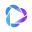 Heygen                       | https://www.heygen.com/               |
| 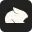 Pika                           | https://pika.art/                     |
| 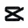 Capcut                       | https://www.capcut.com/               |
|  Submagic                   | https://www.submagic.co/              |
| 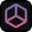 Interior AI              | https://interiorai.com/               |
| 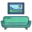 Room GPT                    | https://www.roomgpt.io/               |
|  Mylens                       | https://mylens.ai/                    |
|  Pinokio                     | https://pinokio.computer/             |
|  Ollama                       | https://ollama.com/                   |
|  Deepl                         | https://www.deepl.com/translator      |

### API

| Name                                                                        | URL                                   |
| --------------------------------------------------------------------------- | ------------------------------------- |
|  Jsonplaceholder | https://jsonplaceholder.typicode.com/ |
|  Unsplash               | https://unsplash.com/developers       |
|  Ipinfo                   | https://ipinfo.io/                    |
|  Ipify API                 | https://www.ipify.org/                |
|  Openweathermap   | https://openweathermap.org/           |
|  Ntfy                       | https://ntfy.sh/                      |

### Utility

| Name                                                                                          | URL                                        |
| --------------------------------------------------------------------------------------------- | ------------------------------------------ |
|  Alternativeto                       | https://alternativeto.net/                 |
|  Useful Forks                         | https://useful-forks.github.io/            |
|  Readmi                                     | https://readmi.xyz/                        |
|  Json Crack                              | https://jsoncrack.com/                     |
|  Excalidraw                             | https://excalidraw.com/                    |
|  DBdiagram                               | https://dbdiagram.io/home                  |
|  Regex101                                 | https://regex101.com/                      |
|  Virus Total                            | https://www.virustotal.com/gui/home/upload |
|  List of files by Microsoft | https://files.rg-adguard.net/category      |
|  Skill Icons                            | https://skillicons.dev/                    |
| 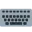 Readme Typing                       | https://readme-typing-svg.herokuapp.com/   |


### Game

| Name                                                                       | URL                            |
| -------------------------------------------------------------------------- | ------------------------------ |
|  Flexbox Froggy   | https://flexboxfroggy.com      |
| 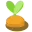 Grid Garden         | https://cssgridgarden.com/     |
|  Flexbox Defense | http://www.flexboxdefense.com/ |
|  CSS Diner             | https://flukeout.github.io/    |
